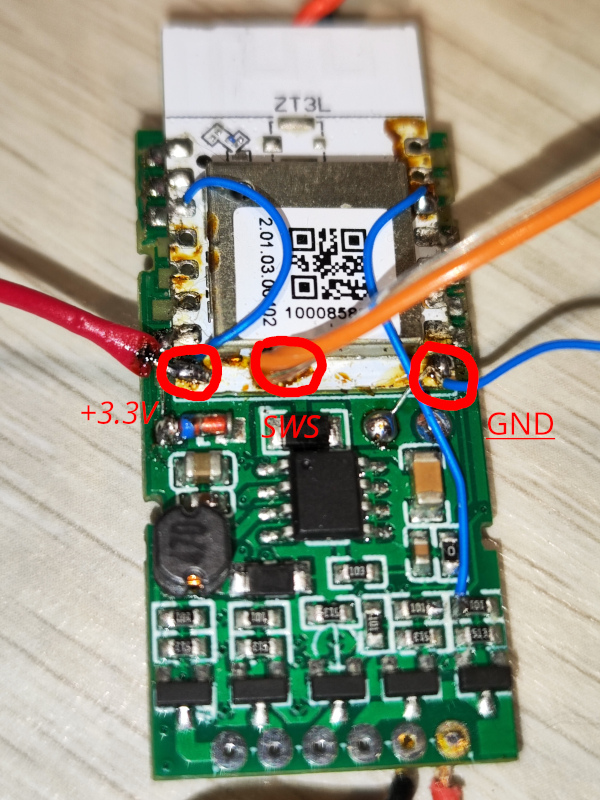
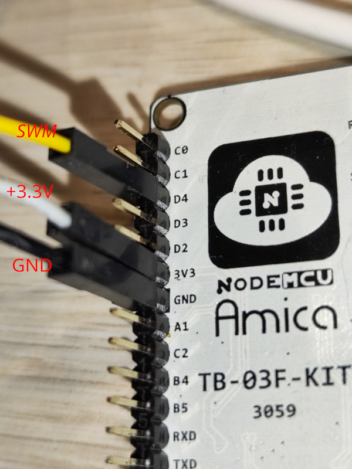

# Flashing

For flashing you can use different hardware programmers - Telink's BDT (expensive), serial converter (work unreliable for me), but I prefer to use TB-03F module from AiThinker
It's cheap (TB-03F kit costs 4-5 USD on Aliexpress) and reliable.
See [this repo](https://github.com/pvvx/TLSRPGM) for details how to make programmer.

## Connection
Don't forget to disconnect power supply from LED controller!  
Solder 3 wires to module as shown   
Connect wires to programmer  
SWS to SWM  
+3.3V to +3.3V  
GND to GND  
See picture of programmer pins 

## Test connection
Test programmer conection - execute command using correct serial port
`python TlsrPgm.py -s -p/dev/ttyUSB0 i`
You should get output like this:
```
=======================================================
TLSR82xx TlsrPgm version 27.04.21
-------------------------------------------------------
Open /dev/ttyUSB0, 230400 bit/s... ok
PGM: ChipID: 0x5562 (TLSR825x), ver: 0.0.0.1
swdiv 5, addrlen 3, swbuf [5a 00 06 02 00 05], pwr On
SWire bit rate: 0.9600 Mbits/s
=== PreProcess ========================================
CPU Stop... ok
=== Process ===========================================
Chip TLSR825x ID: 0x5562, rev: 0x02
CPU PC=0x00000000 ([0x0602] = 0x05)
Flash JEDEC ID: 0xC86014, Size: 1024 kbytes
-------------------------------------------------------
FLASH UID:
000000: 41 50 33 31 39 30 31 07 00 8b 00 b0 ff ff ff ff 
000010: c8 01 ff ff ff ff ff ff ff ff ff ff ff ff ff ff 
-------------------------------------------------------
FLASH:
000000: 58 80 01 30 01 10 5d 02 00 4e 4c 54 70 01 88 00 
000010: 06 81 41 11 01 03 00 00 74 ef 02 00 00 00 00 00 
-------------------------------------------------------
ANALOG REGISTERS:
000000: 48 4c a2 4f 48 02 ff 1d 05 00 00 38 c6 80 00 40 
000010: 00 00 03 00 00 03 00 00 00 00 00 00 00 00 00 40 
000020: 54 00 00 00 00 00 00 00 00 00 00 2e 1f 15 00 00 
000030: 20 20 80 95 80 20 00 00 00 ff 00 00 00 00 00 00 
000040: ed 48 6c 00 80 00 00 00 00 00 00 00 ff ff ff 0f 
000050: 00 00 00 00 00 00 00 00 00 00 00 00 00 00 00 00 
000060: 00 00 00 00 00 00 00 00 00 00 00 00 00 00 00 00 
000070: 00 00 00 00 00 00 00 00 00 00 00 00 00 00 00 01 
000080: 48 4c a2 4f 48 02 ff 1d 05 00 00 38 c6 80 00 40 
000090: 00 00 03 00 00 03 00 00 00 00 00 00 00 00 00 40 
0000a0: 54 00 00 00 00 00 00 00 00 00 00 2e 1f 15 00 00 
0000b0: 20 20 80 95 80 20 00 00 00 ff 00 00 00 00 00 00 
0000c0: 03 49 6c 00 80 00 00 00 00 00 00 00 ff ff ff 0f 
0000d0: 00 00 00 00 00 00 00 00 00 00 00 00 00 00 00 00 
0000e0: 00 00 00 00 00 00 00 00 00 00 00 00 00 00 00 00 
0000f0: 00 00 00 00 00 00 00 00 00 00 00 00 00 00 00 01 
-------------------------------------------------------
REGISTERS:
000060: 00 00 c0 ff 1f 37 20 00 02 00 02 00 01 02 1f 00 
000070: 00 04 00 04 00 00 00 00 00 00 00 64 00 02 62 55
````
## Read flash
Backup existing firmware, just in case
`python TlsrPgm.py -w -t 1 -a 20 -s -p/dev/ttyUSB0 rf 0 0x100000 tuya_1024k_orig.bin`
You should get output
```
=======================================================
TLSR82xx TlsrPgm version 27.04.21
-------------------------------------------------------
Open /dev/ttyUSB0, 230400 bit/s... ok
PGM: ChipID: 0x5562 (TLSR825x), ver: 0.0.0.1
swdiv 5, addrlen 3, swbuf [5a 00 06 02 00 05], pwr On
SWire bit rate: 0.9600 Mbits/s
=== PreProcess ========================================
Hard reset Ext.MCU 5 ms... ok
Activate 20 ms... ok
CPU PC=0x00000000
CPU Stop... ok
=== Process ===========================================
Outfile: tuya_1024k_orig.bin
Read Flash from 0x000000 to 0x100000...
 Worked Time: 63.311 sec       
```
## Write flash
Please note what actual firmware start from address 0x8000. 
To write new firmware execute
`python TlsrPgm.py -w -t 1 -a 20 -s -p/dev/ttyUSB0 we 0x8000 TuyaLight.bin`
You should get output
```
=======================================================
TLSR82xx TlsrPgm version 27.04.21
-------------------------------------------------------
Open /dev/ttyUSB0, 230400 bit/s... ok
PGM: ChipID: 0x5562 (TLSR825x), ver: 0.0.0.1
swdiv 5, addrlen 3, swbuf [5a 00 06 02 00 05], pwr On
SWire bit rate: 0.9600 Mbits/s
=== PreProcess ========================================
Hard reset Ext.MCU 5 ms... ok
Activate 20 ms... ok
CPU PC=0x00000000
CPU Stop... ok
=== Process ===========================================
Inputfile: TuyaLight.bin
Write Flash data 0x00008000 to 0x0002efe4...
 Worked Time: 22.769 sec
```
Now you can disconnect programmer, connect LED, power supply and join zigbee network.

To write original firmware backed up earlier execute
`python TlsrPgm.py -w -t 1 -a 20 -s -p/dev/ttyUSB0 we 0 tuya_1024k_orig.bin`


